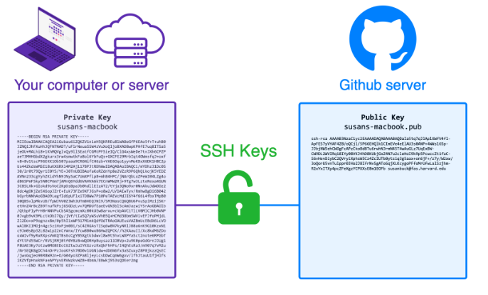
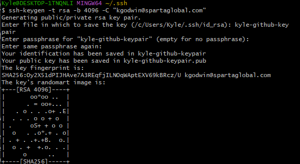
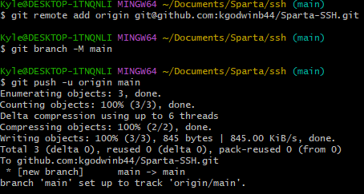

## SSH - Secure Shell

- ### Secure Shell is a network protocol used to securely connect to a remote shell (command line interface)
- ### It runs over Port 22

---

## Shell

- ### A shell is a CLI that allows users to interact directly with the OS
- ### Examples are terminals

---

## How it works
### When we create a SSH Key Pair
- we create a Private key (needs to be kept secure, confidential)
- we create a Public key (can be safely shared)
- keys are used for encryption and authentication



### Where to store private keys
- SSH keys are stored in a hidden dictionary
- Folders that start with . are hidden
- default ssh path .ssh

### Generate key pair:
``` 
ssh-keygen -t rsa -b 4096 -C "any personal info e.g. email" 
```
- -t rsa: Specifies the RSA algorithm (type of key)
- -b 4096: Key length (4096 bits)
- -C: Adds a label/comment (typically your email)



### View the key pair
``` 
cat public-key-name 
```

### Add public key to github
- ### Start the SSH agent
```
eval "$(ssh-agent -s)"
```
- Copy and paste key into ssh key on github
- ### Add the private key
```
ssh-add ~/.ssh/nameofprivatekeypair
```
- ### Test the connection
```
ssh -T git@github.com
```
- ### Use SSH key pair to make a git push


---

## Why a new agent every session
- ### SSH agent is a background process which:
- holds your private keys in memory
- authenticates connections on your behalf without exposing the key
- ### Security reasons
- If agents persist across logins, someone else could use your key without knowledge
- ### Agents are designed for short term key usage
- You can choose when and how long your key is available

## Starting a new agent
- ### head to .ssh dir
- ### start agent
```
eval "$(ssh-agent -s)"
```
- ### add your private key to agent
```
ssh-add ~/.ssh/nameofprivatekeypair
```
- ### Move to repo dir and push